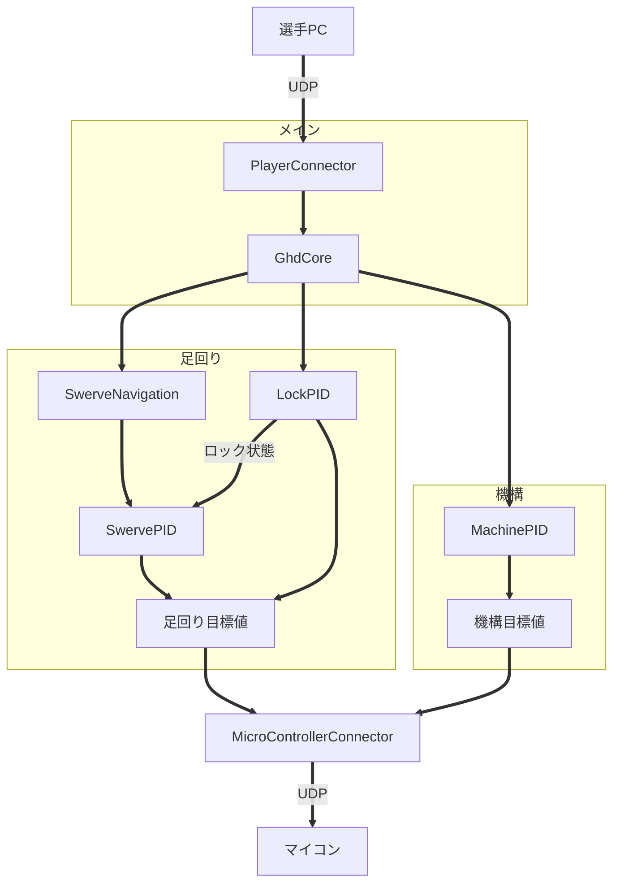

# GhdPlus
2025年「GreatHakoDate」のソフトウェア改修版

# アーキテクチャ

```mermaid
flowchart TD

選手PC ==>|UDP| PlayerConnector

subgraph メイン
PlayerConnector ==> GhdCore
end

subgraph 足回り
GhdCore ==> SwerveNavigation
GhdCore ==> LockPID
SwerveNavigation ==> SwervePID
LockPID ==> |ロック状態|SwervePID
LockPID ==> 足回り目標値
SwervePID ==> 足回り目標値
end

subgraph　機構
GhdCore ==> MachinePID
MachinePID ==> 機構目標値
end


足回り目標値 ==> MicroControllerConnector
機構目標値 ==> MicroControllerConnector
MicroControllerConnector ==> |UDP|マイコン

```